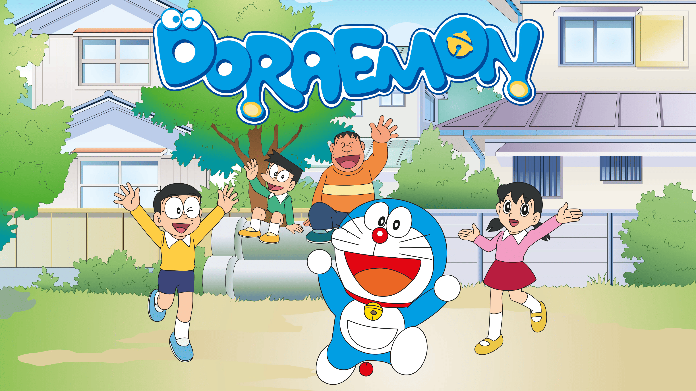

# Academic Deraemon

   

        
   

Doraemon in the academic world, providing everything useful for your research.

# Writing

## Recommended resources

- [清华大学-丁宵汉](https://github.com/hzwer/WritingAIPaper): Writing AI Conference Papers: A Handbook for Beginners
    - 内附多个中文阅读材料，包括：知乎 [1](https://zhuanlan.zhihu.com/p/593195527)-[2](https://zhuanlan.zhihu.com/p/639732057)-[3](https://zhuanlan.zhihu.com/p/627032371)｜[跃问中翻](https://yuewen.cn/share/145749938443137024?utm_source=share&utm_content=web_linkcopy&version=2) | [豆包总结](https://www.doubao.com/thread/w750d882cf0af6419) | [公众号](https://mp.weixin.qq.com/s/MjeBZDV6xapuA_L6ODpVcA)

# Plotting

## Vector websites

- [Remix Icon](https://remixicon.com/): Open-source neutral-style system symbols elaborately crafted for designers and developers. All of the icons are free for both personal and commercial use.
- [Vecteezy](https://www.vecteezy.com/): Vecteezy is an online marketplace where users can license stock photos, vector graphics, and stock footage directly from artists.